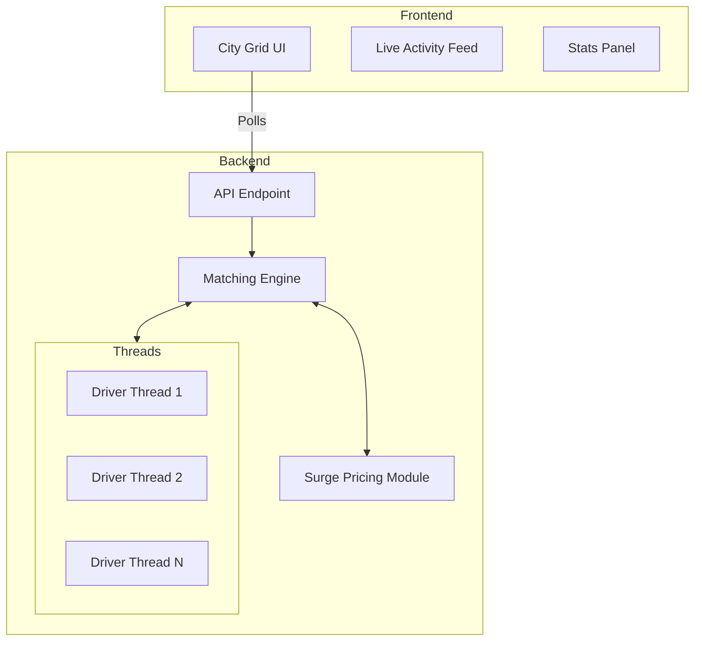

# RideSync 

RideSync is a real-time ride dispatch and surge pricing engine I'm building. The idea is to simulate a modern ride-hailing architecture (like Uber) from scratch. 

It's split into two main parts: a multi-threaded C++ backend that handles all the heavy lifting (spatial tracking, dispatching, and pricing), and a vanilla JS/CSS frontend dashboard to visualize the city grid in real-time.

## Architecture

Here's a quick look at how the system is structured:



## What's working right now

**Frontend (`frontend/`)**
- Built a procedural Manhattan-style city grid (residential, commercial, parks, water).
- Renders top-down car vectors dynamically (green for available, gray for busy).
- Uses a deterministic offset system so cars don't overlap when they're on the same block.
- Live activity feed that logs simulated matches, ETAs, and fares.
- Currently includes a mock JS simulator so you can see the UI working without the backend.

**Backend (`backend/`)**
- Uses `std::thread` and `std::mutex` to spawn independent concurrent threads for drivers, riders, and a central dispatcher.
- **Thread-safe Request Queue**: Uses a `std::condition_variable` to manage incoming ride requests efficiently without CPU-heavy busy waiting.
- **Matching Engine**: Dispatcher uses Euclidean distance to locate and lock the nearest available driver atomically.
- **Dynamic Surge Pricing**: Divides the city grid into geographic zones, calculating real-time supply vs demand (pending requests vs available drivers) to automatically apply surge multipliers.

## How to run it

### Frontend
Since it's vanilla JS/HTML, you just need a basic local web server to bypass CORS:
```bash
cd frontend
python3 -m http.server 8080
```
Then open `http://localhost:8080` in your browser.

### Backend
The backend is written in C++17. You can compile and run it with clang++:
```bash
cd backend
clang++ -std=c++17 -pthread main.cpp -o sim
./sim
```

## What's next
- [ ] Connect the frontend directly to the C++ backend (likely via a local HTTP API).
- [x] Build out the actual rider matching algorithm in C++.
- [x] Implement the surge pricing logic based on driver/rider density.

Feel free to poke around the code or run the simulation locally!
