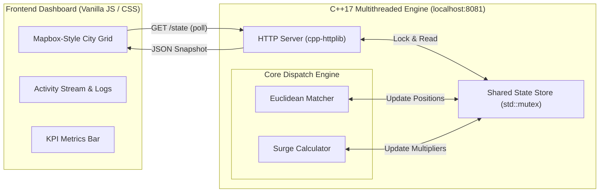
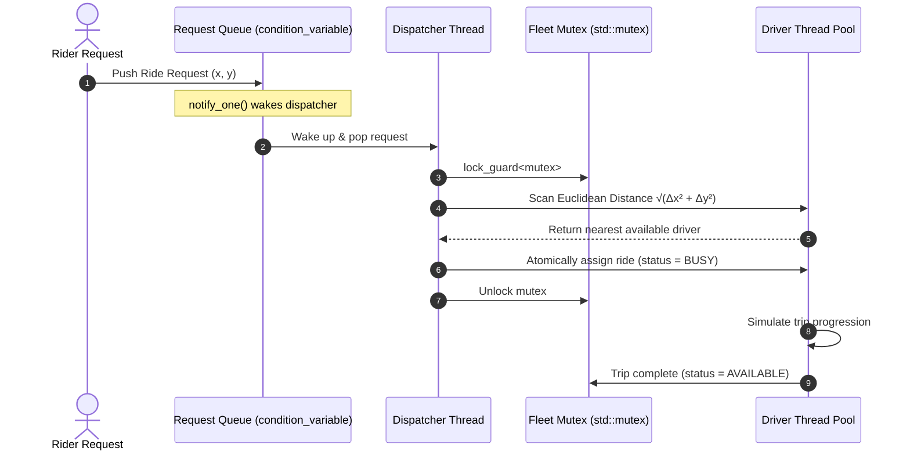
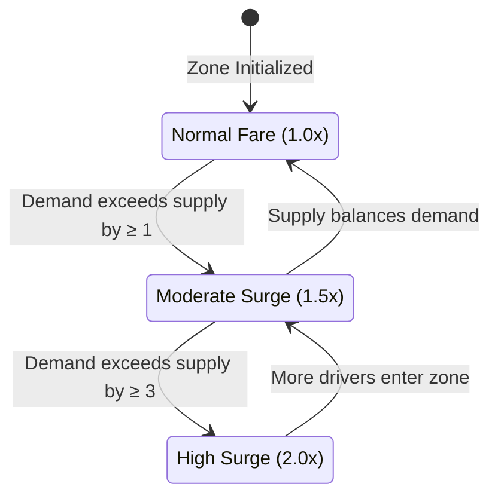

# RideSync 

RideSync is a real-time ride dispatch and surge pricing engine I'm building. The idea is to simulate a modern ride-hailing architecture (like Uber) from scratch. 

It's split into two main parts: a multi-threaded C++ backend that handles all the heavy lifting (spatial tracking, dispatching, and pricing), and a vanilla JS/CSS frontend dashboard to visualize the city grid in real-time.

## Architecture

To ensure high throughput and realistic dispatch latency without CPU-heavy busy waiting, RideSync separates spatial presentation from concurrency logic across an integrated HTTP pipeline:

### 1. System Topology & Data Flow

```mermaid
flowchart LR
    subgraph Client ["Frontend Dashboard (Vanilla JS / CSS)"]
        UI["Mapbox-Style City Grid"]
        Feed["Activity Stream & Logs"]
        Stats["KPI Metrics Bar"]
    end

    subgraph Server ["C++17 Multithreaded Engine (localhost:8081)"]
        HTTP["HTTP Server (cpp-httplib)"]
        State["Shared State Store (std::mutex)"]
        
        subgraph Engine ["Core Dispatch Engine"]
            Match["Euclidean Matcher"]
            Surge["Surge Calculator"]
        end
    end

    UI -->|"GET /state (poll)"| HTTP
    HTTP -->|"JSON Snapshot"| UI
    HTTP <-->|"Lock & Read"| State
    Match <-->|"Update Positions"| State
    Surge <-->|"Update Multipliers"| State
```

### 2. Multithreaded Dispatch Concurrency Sequence
When ride requests enter the system, they are processed asynchronously using condition variables and mutex-protected spatial lookups to guarantee atomic vehicle assignment:


```mermaid
sequenceDiagram
    autonumber
    actor Rider as Rider Request
    participant Queue as Request Queue (condition_variable)
    participant Dispatcher as Dispatcher Thread
    participant Mutex as Fleet Mutex (std::mutex)
    participant Driver as Driver Thread Pool

    Rider->>Queue: Push Ride Request (x, y)
    Note over Queue: notify_one() wakes dispatcher
    Queue->>Dispatcher: Wake up & pop request
    Dispatcher->>Mutex: lock_guard<mutex>
    Dispatcher->>Driver: Scan Euclidean Distance √(Δx² + Δy²)
    Driver-->>Dispatcher: Return nearest available driver
    Dispatcher->>Driver: Atomically assign ride (status = BUSY)
    Dispatcher->>Mutex: Unlock mutex
    Driver->>Driver: Simulate trip progression
    Driver->>Mutex: Trip complete (status = AVAILABLE)
```

### 3. Dynamic Surge Pricing State Machine
The grid evaluates local zone density (Pending Requests vs. Available Drivers) in real time, automatically transitioning pricing tiers and rendering glowing radial overlays:


```mermaid
stateDiagram-v2
    [*] --> NormalFare: Zone Initialized
    
    state "Normal Fare (1.0x)" as NormalFare
    state "Moderate Surge (1.5x)" as ModerateSurge
    state "High Surge (2.0x)" as HighSurge
    
    NormalFare --> ModerateSurge: Demand exceeds supply by ≥ 1
    ModerateSurge --> HighSurge: Demand exceeds supply by ≥ 3
    HighSurge --> ModerateSurge: More drivers enter zone
    ModerateSurge --> NormalFare: Supply balances demand
```

## What's working right now

**Frontend (`frontend/`)**
- Built a Mapbox-style stylized abstract city map with avenue road networks, dashed centerlines, and block texture/shade variations.
- Renders top-down car vectors dynamically with above-surface drop shadows, directional rotation, and motion transition trails.
- Uses an anti-overlap arc clustering system so cars stay readable without clipping when sharing the same city block.
- **Elevated Landmark Labels**: Features iconic landmarks (🌲 Central Park, 🌊 East River Canal, 🏢 Financial District, 🎭 Midtown / Times Square) rendered on a high z-index layer so label text remains 100% visible above vehicle markers.
- **Simulation Controls**: Includes a live Simulation ON/OFF toggle button to pause or resume real-time state polling and rider spawning.
- **Fleet Metrics Breakdown**: Dashboard KPI cards show total active fleet capacity with an instant real-time subtext split (`X available · Y en route`).
- Live activity feed and multithreaded log streaming directly from the C++ engine.

**Backend (`backend/`)**
- Uses `std::thread` and `std::mutex` to spawn independent concurrent threads for drivers, riders, and a central dispatcher.
- **Real-Time HTTP Server**: Integrated standalone header-only HTTP server (`httplib.h` and `json.hpp`) serving live JSON state snapshots on `http://localhost:8081/state`.
- **Thread-safe Request Queue**: Uses a `std::condition_variable` to manage incoming ride requests efficiently without CPU-heavy busy waiting.
- **Matching Engine**: Dispatcher uses Euclidean distance to locate and lock the nearest available driver atomically.
- **Dynamic Surge Pricing**: Divides the city grid into geographic zones, calculating real-time supply vs demand (pending requests vs available drivers) to automatically apply surge multipliers and glowing radial heat-map overlays.

## How to run it

### Running the Live Integration
You can run the full integrated stack (C++ backend server + frontend UI):

1. **Start the C++ Backend Server:**
```bash
cd backend
clang++ -std=c++17 -pthread main.cpp -o sim
./sim
```
The server will start listening on port `8081`.

2. **Open the Frontend Dashboard:**
Open `frontend/index.html` directly in your browser or start a lightweight static server:
```bash
cd frontend
python3 -m http.server 8080
```
Then navigate to `http://localhost:8080` (or `http://localhost:8081` if serving static assets directly from the backend).

## What's next
- [x] Connect the frontend directly to the C++ backend via local HTTP API.
- [x] Build out the actual rider matching algorithm in C++.
- [x] Implement the surge pricing logic based on driver/rider density.
- [x] Implement Mapbox-style stylized operations map and simulation toggle controls.
- [ ] Add historical analytics and ride completion metrics.

Feel free to poke around the code or run the simulation locally!
