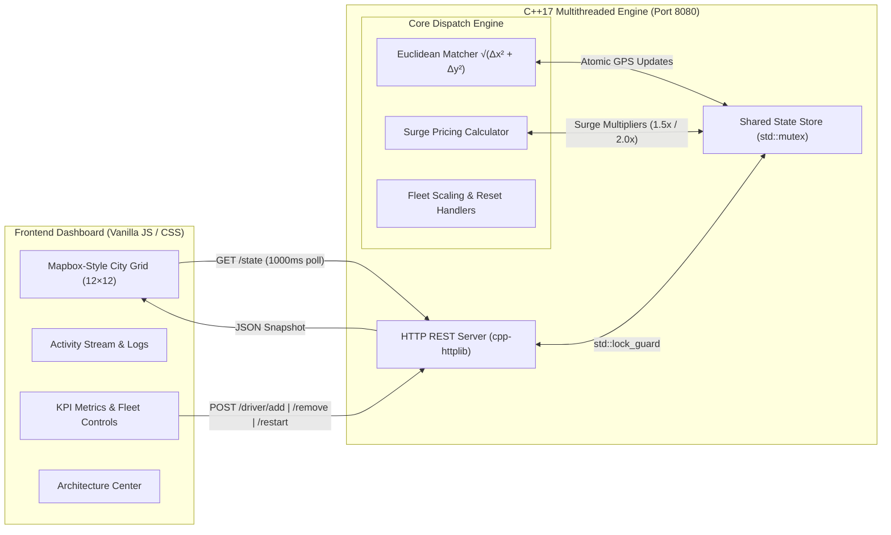
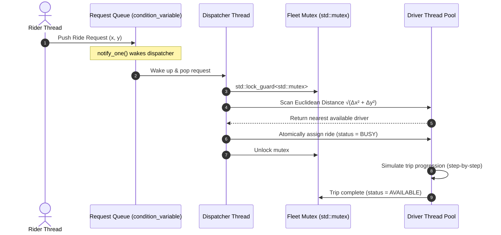
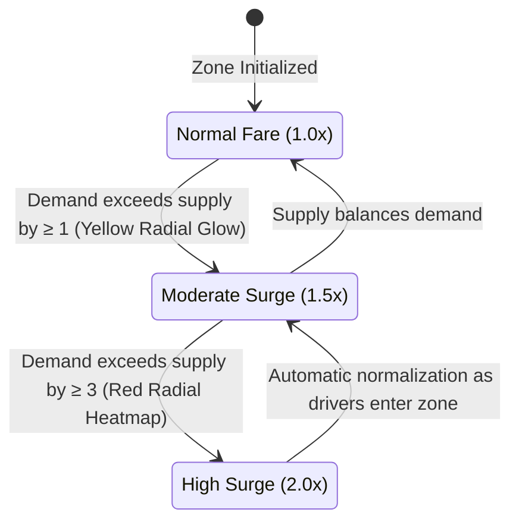

# RideSync 🚗⚡

RideSync is a real-time, multi-threaded ride dispatch and surge pricing engine. The project simulates a modern, cloud-native ride-hailing architecture (like Uber or Lyft) from scratch, coupling an autonomous C++17 backend with a high-performance 60 FPS vanilla JavaScript/CSS visualization dashboard.

### 🌐 Live Cloud Demo
**Experience the live production application deployed on Render:**  
👉 **[https://ridesync-dispatch-engine.onrender.com](https://ridesync-dispatch-engine.onrender.com)**

---

## 🏛️ System Architecture

To ensure high throughput and realistic dispatch latency without CPU-heavy busy waiting, RideSync separates spatial presentation from concurrency logic across a clean HTTP REST pipeline.

> **Note:** A dedicated, standalone systems engineering specification page with custom embedded SVG diagrams is included in the live app at **[`/architecture.html`](https://ridesync-dispatch-engine.onrender.com/architecture.html)**.

### 1. System Topology & Data Flow

```mermaid
flowchart LR
    subgraph Client ["Frontend Dashboard (Vanilla JS / CSS)"]
        UI["Mapbox-Style City Grid (12×12)"]
        Feed["Activity Stream & Logs"]
        Stats["KPI Metrics & Fleet Controls"]
        Arch["Architecture Center"]
    end

    subgraph Server ["C++17 Multithreaded Engine (Port 8080)"]
        HTTP["HTTP REST Server (cpp-httplib)"]
        State["Shared State Store (std::mutex)"]
        
        subgraph Engine ["Core Dispatch Engine"]
        Match["Euclidean Matcher √(Δx² + Δy²)"]
        Surge["Surge Pricing Calculator"]
        Scale["Fleet Scaling & Reset Handlers"]
        end
    end

    UI -->|"GET /state (1000ms poll)"| HTTP
    HTTP -->|"JSON Snapshot"| UI
    Stats -->|"POST /driver/add | /remove | /restart"| HTTP
    HTTP <-->|"std::lock_guard"| State
    Match <-->|"Atomic GPS Updates"| State
    Surge <-->|"Surge Multipliers (1.5x / 2.0x)"| State
```

### 2. Multithreaded Dispatch Concurrency Sequence
When ride requests enter the system, they are processed asynchronously using condition variables (`std::condition_variable`) and mutex-protected spatial lookups to guarantee atomic vehicle assignment without data races:


```mermaid
sequenceDiagram
    autonumber
    actor Rider as Rider Thread
    participant Queue as Request Queue (condition_variable)
    participant Dispatcher as Dispatcher Thread
    participant Mutex as Fleet Mutex (std::mutex)
    participant Driver as Driver Thread Pool

    Rider->>Queue: Push Ride Request (x, y)
    Note over Queue: notify_one() wakes dispatcher
    Queue->>Dispatcher: Wake up & pop request
    Dispatcher->>Mutex: std::lock_guard<std::mutex>
    Dispatcher->>Driver: Scan Euclidean Distance √(Δx² + Δy²)
    Driver-->>Dispatcher: Return nearest available driver
    Dispatcher->>Driver: Atomically assign ride (status = BUSY)
    Dispatcher->>Mutex: Unlock mutex
    Driver->>Driver: Simulate trip progression (step-by-step)
    Driver->>Mutex: Trip complete (status = AVAILABLE)
```

### 3. Dynamic Surge Pricing State Machine
The grid evaluates local zone density (Pending Requests vs. Available Drivers) in real time, automatically transitioning pricing tiers and rendering glowing radial overlays:


```mermaid
stateDiagram-v2
    [*] --> NormalFare: Zone Initialized
    
    state "Normal Fare (1.0x)" as NormalFare
    state "Moderate Surge (1.5x)" as ModerateSurge
    state "High Surge (2.0x)" as HighSurge
    
    NormalFare --> ModerateSurge: Demand exceeds supply by ≥ 1 (Yellow Radial Glow)
    ModerateSurge --> HighSurge: Demand exceeds supply by ≥ 3 (Red Radial Heatmap)
    HighSurge --> ModerateSurge: Automatic normalization as drivers enter zone
    ModerateSurge --> NormalFare: Supply balances demand
```

---

## ✨ Key Features & Capabilities

### 🖥️ Frontend Dashboard (`frontend/`)
- **Interactive 12×12 City Grid**: A Mapbox-styled abstract city map featuring avenue road networks, dashed centerlines, bridges, and building block shade variations.
- **Dynamic 60 FPS Animations**: Renders top-down vehicle vectors with drop shadows, directional heading rotation, and smooth motion transition trails.
- **Anti-Overlap Arc Clustering**: Automatically curves overlapping vehicle trajectories when cars share the same city intersection so labels never clip.
- **Elevated Landmark Layers**: Features iconic landmarks (🌲 *Central Park*, 🌊 *East River Canal*, 🏢 *Financial District*, 🎭 *Midtown / Times Square*) on an elevated z-index so text remains 100% readable above traffic.
- **Real-Time Fleet Scaling**: Live **`+ Add`** and **`− Remove`** buttons allow dynamically spawning or terminating autonomous C++ driver threads on the fly.
- **Simulation Controls**: Includes a **🟢 Simulation: ON/OFF** toggle and a **🔄 Restart** button that calls the backend `/restart` API to instantly reset driver positions and trip queues.
- **Live C++ Mutex Monitor**: Stream real-time thread synchronization logs (`LOCK driver_mutex`, `notify_one() sent`, `MATCH SUCCESS`) directly into the UI.

### ⚙️ C++17 Backend Engine (`backend/`)
- **Native OS Multithreading**: Spawns standalone `std::thread` workers for drivers, riders, and the dispatch engine.
- **Zero Data Races**: Protects all shared vehicle lists, ride queues, and console logs using `std::mutex` and RAII `std::lock_guard`.
- **Condition Variables**: Avoids CPU-heavy busy-waiting loops by sleeping dispatcher threads via `cv.wait()` until woken by `cv.notify_one()`.
- **Euclidean Spatial Matcher**: Calculates shortest straight-line distances ($\sqrt{\Delta x^2 + \Delta y^2}$) across the grid to assign optimal drivers.
- **Embedded HTTP REST Server**: Powered by header-only `cpp-httplib` and `nlohmann/json`, serving atomic state snapshots and control endpoints (`/state`, `/driver/add`, `/driver/remove`, `/restart`).

---

## 🚀 Getting Started & Local Setup

### Option 1: Docker (Recommended)
You can build and run the complete production container locally using Docker:
```bash
docker build -t ridesync .
docker run -p 8080:8080 ridesync
```
Then open your browser and navigate to: `http://localhost:8080`

### Option 2: Manual C++ Build
If you prefer compiling the C++ engine directly on your machine:
```bash
# 1. Compile C++ backend with C++17 and pthread optimization
cd backend
g++ -std=c++17 -pthread -O2 main.cpp -o server

# 2. Run the server (defaults to port 8080, or reads $PORT)
./server
```
Once the server is running, open `frontend/index.html` in your web browser or serve it via any static server:
```bash
cd frontend
python3 -m http.server 3000
```

---

## 🗺️ Project Roadmap Status
- [x] **Core Dispatch Engine**: Connect frontend directly to C++ backend via local HTTP REST API.
- [x] **Spatial Matchmaking**: Build out Euclidean straight-line distance rider matching algorithm in C++.
- [x] **Surge State Machine**: Implement real-time surge pricing logic and heatmaps based on zone density.
- [x] **Interactive Visualization**: Build Mapbox-style stylized operations map with 60 FPS vehicle animations.
- [x] **Live Fleet Control**: Real-time thread scaling (`+ Add` / `− Remove` drivers) and simulation reset controls.
- [x] **Systems Engineering Docs**: Standalone `/architecture.html` blueprint with human-written specs and custom SVGs.
- [x] **Cloud Production Deployment**: Dockerized and deployed live on Render cloud platform.

---
*Built with C++17, Vanilla JavaScript, and CSS.*
