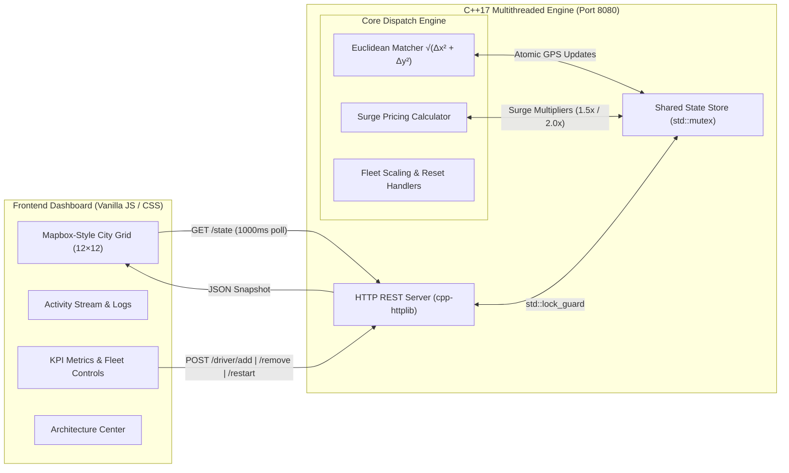
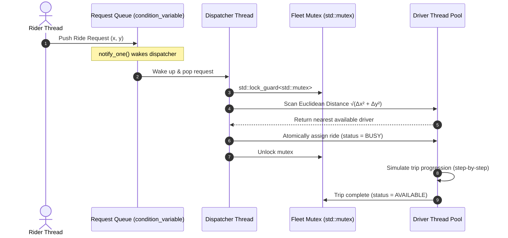
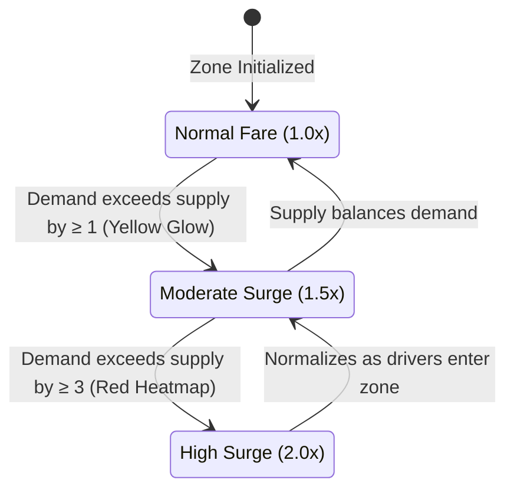

# RideSync

RideSync is a multithreaded ride dispatch and surge pricing engine built from scratch. The project simulates a core ride-hailing backend (similar to Uber or Lyft) using standalone C++17 worker threads, coupled with a real-time web dashboard to visualize vehicle movements and thread synchronization.

Live Demo: https://ridesync-dispatch-engine.onrender.com  
Architecture Blueprint: https://ridesync-dispatch-engine.onrender.com/architecture.html

## System Architecture

To keep dispatch latency low and avoid CPU-heavy busy waiting, the spatial presentation layer is completely decoupled from the C++ concurrency engine over a lightweight HTTP REST pipeline.

### 1. System Topology & Data Flow

```mermaid
flowchart LR
    subgraph Client ["Frontend Dashboard (Vanilla JS / CSS)"]
        UI["Mapbox-Style City Grid (12×12)"]
        Feed["Activity Stream & Logs"]
        Stats["KPI Metrics & Fleet Controls"]
        Arch["Architecture Center"]
    end

    subgraph Server ["C++17 Multithreaded Engine (Port 8080)"]
        HTTP["HTTP REST Server (cpp-httplib)"]
        State["Shared State Store (std::mutex)"]
        
        subgraph Engine ["Core Dispatch Engine"]
        Match["Euclidean Matcher √(Δx² + Δy²)"]
        Surge["Surge Pricing Calculator"]
        Scale["Fleet Scaling & Reset Handlers"]
        end
    end

    UI -->|"GET /state (1000ms poll)"| HTTP
    HTTP -->|"JSON Snapshot"| UI
    Stats -->|"POST /driver/add | /remove | /restart"| HTTP
    HTTP <-->|"std::lock_guard"| State
    Match <-->|"Atomic GPS Updates"| State
    Surge <-->|"Surge Multipliers (1.5x / 2.0x)"| State
```

### 2. Multithreaded Dispatch Concurrency Sequence
When ride requests enter the system, they are handled asynchronously using condition variables and mutex-protected spatial lookups to ensure atomic vehicle assignments without data races:


```mermaid
sequenceDiagram
    autonumber
    actor Rider as Rider Thread
    participant Queue as Request Queue (condition_variable)
    participant Dispatcher as Dispatcher Thread
    participant Mutex as Fleet Mutex (std::mutex)
    participant Driver as Driver Thread Pool

    Rider->>Queue: Push Ride Request (x, y)
    Note over Queue: notify_one() wakes dispatcher
    Queue->>Dispatcher: Wake up & pop request
    Dispatcher->>Mutex: std::lock_guard<std::mutex>
    Dispatcher->>Driver: Scan Euclidean Distance √(Δx² + Δy²)
    Driver-->>Dispatcher: Return nearest available driver
    Dispatcher->>Driver: Atomically assign ride (status = BUSY)
    Dispatcher->>Mutex: Unlock mutex
    Driver->>Driver: Simulate trip progression (step-by-step)
    Driver->>Mutex: Trip complete (status = AVAILABLE)
```

### 3. Dynamic Surge Pricing State Machine
The backend evaluates local zone density (pending requests vs. available drivers) in real time, adjusting pricing tiers and triggering visual heatmap overlays on the map:


```mermaid
stateDiagram-v2
    [*] --> NormalFare: Zone Initialized
    
    state "Normal Fare (1.0x)" as NormalFare
    state "Moderate Surge (1.5x)" as ModerateSurge
    state "High Surge (2.0x)" as HighSurge
    
    NormalFare --> ModerateSurge: Demand exceeds supply by ≥ 1 (Yellow Glow)
    ModerateSurge --> HighSurge: Demand exceeds supply by ≥ 3 (Red Heatmap)
    HighSurge --> ModerateSurge: Normalizes as drivers enter zone
    ModerateSurge --> NormalFare: Supply balances demand
```

## Features

### Frontend Dashboard (`frontend/`)
- Abstract 12x12 city grid styled with avenue road networks, dashed centerlines, and landmark markers (Central Park, Times Square, Financial District).
- Smooth CSS vehicle animations with drop shadows, directional heading rotation, and motion trails.
- Anti-overlap clustering algorithm that curves vehicle paths when multiple cars cross the same intersection so markers remain readable.
- Real-time fleet controls to add or remove driver threads on the fly, pause the simulation, or trigger an engine restart.
- Live console monitor streaming internal C++ mutex synchronization events (`LOCK driver_mutex`, `notify_one() sent`, `MATCH SUCCESS`) directly to the UI.

### C++17 Backend Engine (`backend/`)
- Uses `std::thread` to spawn independent OS threads for individual drivers, riders, and the dispatch coordinator.
- Prevents data races across shared vehicle lists and request queues using RAII `std::lock_guard` and `std::mutex`.
- Avoids CPU polling waste by sleeping worker threads via `std::condition_variable` until woken by new ride events.
- Euclidean spatial matcher that scans available drivers and calculates shortest straight-line distances ($\sqrt{\Delta x^2 + \Delta y^2}$) to pick-up pins.
- Standalone HTTP REST server implemented with `cpp-httplib` and `nlohmann/json`, serving live JSON state snapshots and API control endpoints.

## Local Setup & Development

### Using Docker
The simplest way to run the full stack locally is with Docker:

```bash
docker build -t ridesync .
docker run -p 8080:8080 ridesync
```

Once running, open your browser to `http://localhost:8080`.

### Manual C++ Build
To compile and run the backend manually without Docker:

```bash
# 1. Compile C++ backend with pthread support
cd backend
g++ -std=c++17 -pthread -O2 main.cpp -o server

# 2. Start the backend server (defaults to port 8080)
./server
```

With the server running, open `frontend/index.html` in your web browser or start a local static server:

```bash
cd frontend
python3 -m http.server 3000
```

## Roadmap Status
- [x] Connect frontend dashboard directly to C++ backend via local HTTP REST API
- [x] Build out Euclidean straight-line distance matching algorithm in C++
- [x] Implement dynamic surge pricing logic and heatmaps based on real-time zone density
- [x] Create Mapbox-style abstract operations map with smooth car animations
- [x] Implement live fleet thread scaling (`+ Add` / `- Remove`) and simulation reset controls
- [x] Write standalone architecture engineering specification page (`/architecture.html`)
- [x] Dockerize and deploy production build live on Render
